# Explanation Instagram Login

Explicação sobre como fazer login com Instagram.

## Criar uma aplicação

1. Entrar em `https://developers.facebook.com/apps` e apertar em para criar um aplicativo:

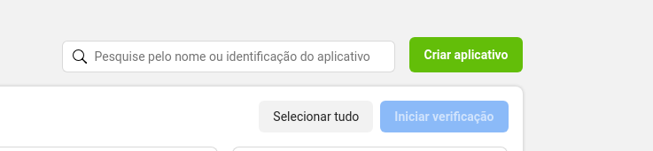

2. Escolher o tipo de aplicativo consumidor ou nenhum:

---

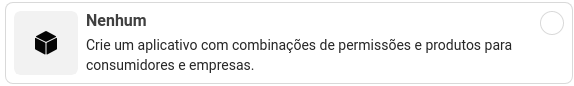

3. Definir as informações do app:

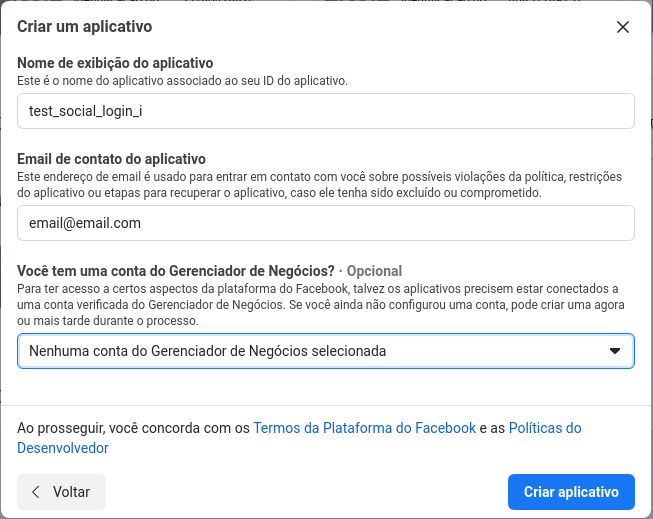

4. Aperte em concluir, para isso será requisitado sua senha.

5. Volte em meus aplicativos, veja o seu aplicativo e aperte nos três pontos:
   
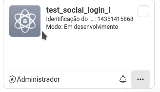

1. Aperte para criar um aplicativo de teste (essa parte é importante pois para o aplicativo talvez seja necessário algumas validações que só vão ser feitas quando o app entrar em produção):

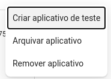

7. Aperte em confirmar ao criar o aplicativo de teste:

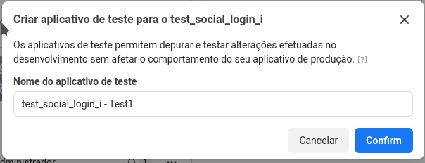

8. Digite sua senha.

9.  Abra o aplicativo de teste:

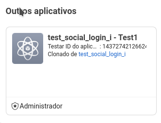
   
10. Talvez seja necessário configurar o app no geral.

11. Comece indo em Configurações > Básico > Adicionar Plataforma (Deve ser encontrado no fim da página e clique nele):

12. Escolha a plataforma para a qual deseja fazer o login, no exemplo, será utilizado a Web:

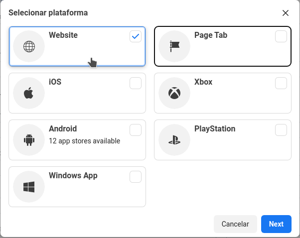

13. Vá em Produtos > Adicionar Produtos e escolha Exibição básica do instagram (Note que ele só aparece nos aplicativos de tipo consumidor ou nenhum, em apps com tipo diferente, não deve aparecer) e aperte em configurar:

14. Vá em Produtos > Exibição básica do Instagram e aperte para Criar um novo App (Create new app, no fim da página):

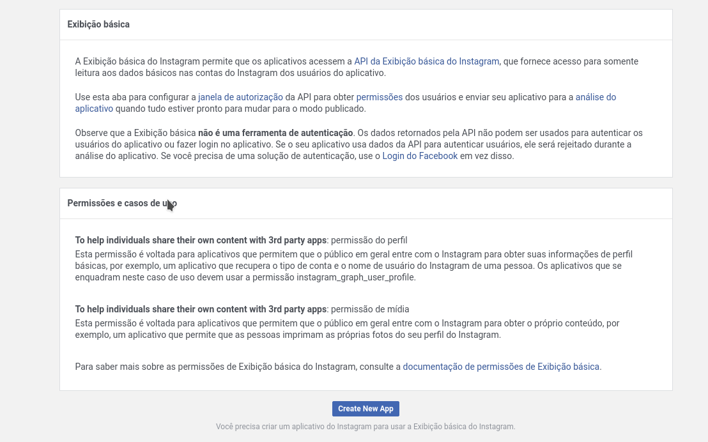

15. Ao criar, você tem acesso a duas informações importantes, o `client_id` (Id do aplicativo do instagram) e a `secret_key` (Chave secreta do aplicativo do instagram):

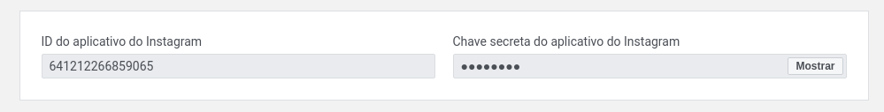

16. Abaixo disso tem o nome da aplicação e abaixo você precisa definir as url de redirecionamento, nesse caso estarei usando redirecionando para um site online pois o facebook não permite utilizar páginas sem https ou localhost:

17. A informação mais importante por hora são a URIs de redirecionamento do OAuth válidos, pois essa será a nossa `redirect_uri`, as outras preencha com o mesmo valor por hora, mas elas são importante apenas para o futuro.

18. As informações importantes que você precisa saber são
    - `client_id`
    - `secret_key`
    - `redirect_uri`

19. A par dessas informações, vá em Funções > Funções: 

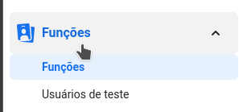

20. Vá até em adicionar testadores do instagram e aperte em adicionar:

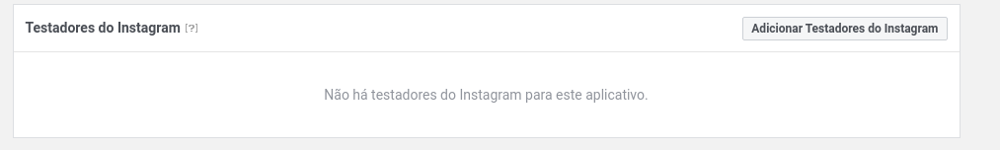

21. Adicione seu nome de usuário e aperte em Enviar:

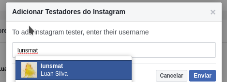

22. Após isso deve aparecer o seu usuário como pendente:

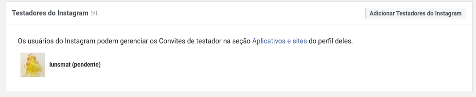

23. Abra o seu perfil do instagram e vá em settings:

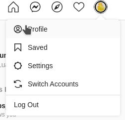

24. Vá em Apps and Websites > Tester Invites, procure pelo nome do seu app e aperte em Accept:

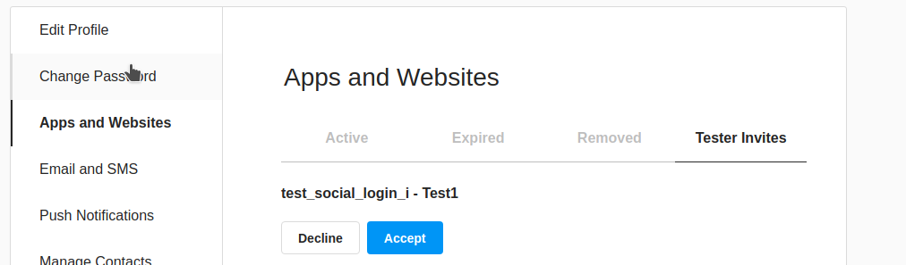

25. Com isso, você pode achar permitido tanto em active no instagram quanto na tela de usuários de teste no aplicativo do facebook.

26. Agora, abra o navegador, e entre na rota https://api.instagram.com/oauth/authorize?response_type=code&scope=user_profile&client_id=`client_id`&redirect_uri=`redirect_uri`
    - Troque tanto a `client_id` e a `redirect_uri` pelos valores que você tem
    - O `scope` serve para falar ao usuário a informação que você deseja dele, nesse caso será requisitado apenas o `user_profile` (perfil de usuário)
    - O `response_type` é o tipo de resposta, o padrão é code

27. Esse url vai para a tela onde você vai dá permissão do usuário (o seu que você adicionou de teste) e aperte em Allow:

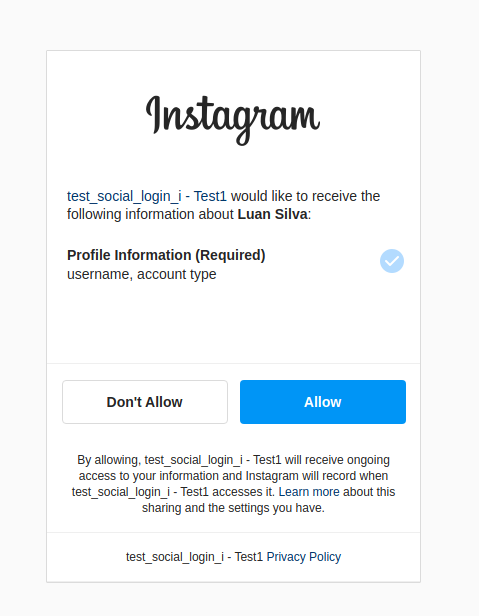

28. Após isso, o instagram irá redirecionar para a página que você definiu em `redirect_uri` e ela irá mandar o code nos parâmetros get:

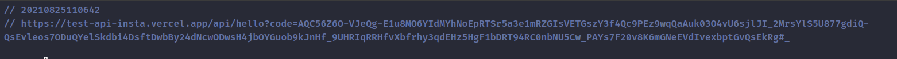

29. Manualmente, pegue o valor do code, com vamos usar ele para pegar o login do user.

30. Dessa maneira, entre em um aplicativo para testar api (pode ser postman, mas eu estou utilizando o insomnia), e abra uma rota **_POST_** para `https://api.instagram.com/oauth/access_token` e nos corpo da requisição mande os parâmetros:
    - `client_id`: o id da aplicação
    - `client_secret`: a chave secreta da aplicação
    - `code`: O código que você pegou
    - `grant_type`: Coloque o valor para **authorization_code**
    - `redirect_uri`: a sua url de redirecionamento (embora a rota não seja redirecionada)

31. Aperte para enviar a requisição e o retorno será o `user_id` do usuário e o `access_token` em JSON:

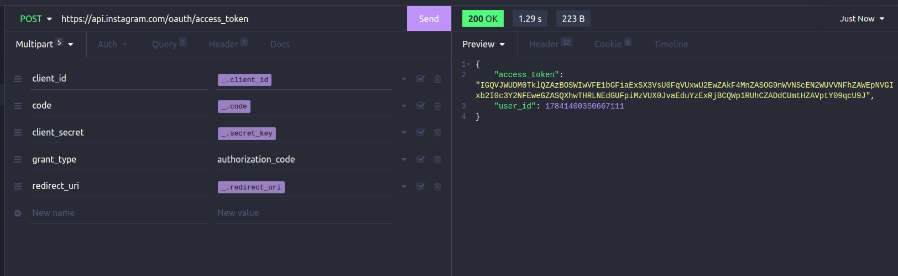

32. Guarde esse `access_token` pois ele quem vai ser necessário para pegar dados do usuário, em relação ao `user_id` no final, vou falar mais dele como alternativa.

33. Após isso, acesse `https://graph.instagram.com/me` via **GET** e pelôs parâmetros get, ou Query Params, mande:
    - `fields`: Os campos do usuário que você quer separado por vírgula (no exemplo será pego o username e o id)
    - `access_token`: o token de acesso que você acabou de pegar

34. Aperte para enviar as informações e o retorno será os fields em json com os fields que você requisitou:

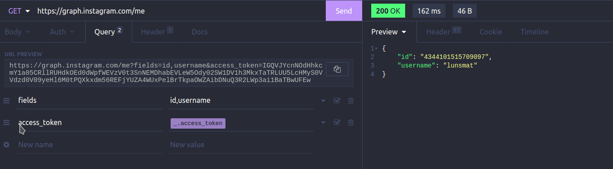

35. Nesse momento, você tem já tem duas alternativas para o login com o instagram, o `id` que você acabou de pegar, ou o `user_id` que foi mostrado anteriormente, ambos são únicos, e você pode utilizar para salvar no banco de dados o id do usuário do instagram e na hora de esse id pode ser pego para verificar se o usuário existe, criar ele, e pegar esse usuário para fazer login.
